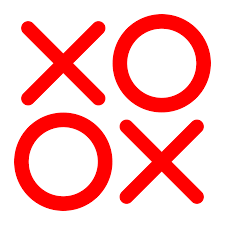
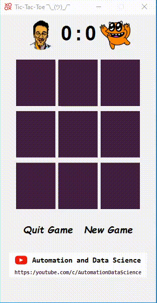

<div id="top"></div>

<!-- PROJECT LOGO -->
<br />
<div align="center">
  <a href="">
    
  </a>

<h3 align="center">Jogo da Velha | Jogo do Galo | Tic-Tac-Toe</h3>
Implementação de um <i>algoritmo de resposta</i> para o jogo da velha, também designado como jogo do galo ou tic-tac-toe em inglês.
  <p align="center">
    <a href="">Demo</a>
    ·
    <a href="">Tutorial em Vídeo</a>
    ·
    <a href="">Desafio Adicional</a>
  </p>
  <br>
</div>


<!-- ABOUT THE PROJECT -->
### Sobre este projecto
Este projeto foi desenhado para ajudar programadores iniciantes e juniores a desenvolver as suas capacidades de python. Os projetos com base no Jogo da Velha (Tic-Tac-Toe) são clássicos em várias linguagens de programação.

Contudo, neste projeto vamos aprofundar o potencial deste exemplo.
Com base no artigo científico de [Crowle & Siegle, (1993)](https://onlinelibrary.wiley.com/doi/abs/10.1207/s15516709cog1704_3),
para além de construirmos uma aplicação deste jogo, iremos também **construir um algoritmo que jogará contra um jogador humano**.

<br>
Dificuldade: ★★☆☆☆


Este projeto foi desenvolvido por [Tiago C. Reis](https://github.com/tiago-c-reis) e é meramente para fins educacionais.

<p align="right">(<a href="#top">voltar ao topo</a>)</p>


### Objetivos do projeto
👉 **Estruturar um projeto** em Python <br>
<i>Como organizar ficheiros e pastas?</i>


👉 **Desenvolver um aplicativo** com base no pacote tkinter<br>
<i>Como desenvolver uma aplicação? root, frames, buttons, labels, etc.</i>


👉 **Modelar a resposta** da máquina com base num artigo científico<br>
<i>Como definir funções entre módulos?<br>
Criar dois níveis para a máquina: Fácil e Difícil</i>


👉 **Criar um ficheiro executável** do projeto<br>
<i>Como criar um ficheiro executável?</i>

<p align="right">(<a href="#top">voltar ao topo</a>)</p>


<!-- Demo GIF -->
### Demo

Image em formato .gif que representa o funcionamento do aplicativo desenvolvido




___
### Recursos
Lista de recursos recomendados:

Vídeos:

* [Vídeo com tutorial completo]()

* [Demo em vídeo]()

* [Desafio adicional]()

Repositórios:

* [TicTacToe](https://github.com/tiago-c-reis/projetos_educacionais/TicTacToe)
<p align="right">(<a href="#top">voltar ao topo</a>)</p>

___

O canal de YouTube [Automation and Data Science](http://youtube.com/c/AutomationDataScience) é um projeto educativo
gratuito e em português. A missão do canal é ajudar todos a entrarem no mundo da programação.


Considere [subscrever](http://youtube.com/c/AutomationDataScience?sub_confirmation=1) o canal e promover junto dos seus
familiares, amigos e colegas. 

```python
msg_final = "A melhor forma de ajudar este projeto é partilhar e subscrever."

while True:
    print(msg_final)
```
[![YouTube][youtube-shield]][youtube-url]


### Notas Adicionais
* Atendendo aos objetivos e público alvo desde projeto, o mesmo está desenvolvido em **programação procedural/ procedimental**.
* Existe um **desafio adicional**: <br>
Se a máquina jogar corretamente nunca perde, ou seja, ganha ou empata sempre. Os programadores são desafiados a melhorar o
modelo proposto.
<br>
<br>
Sugestão: Antes da máquina colocar no centro `pos = 4` existe o conceito de <i>fork</i> e <i>block_fork</i>. O mesmo encontra-se
 descrito em Crowle & Siegle, (1993).

<p align="right">(<a href="#top">voltar ao topo</a>)</p>

<!-- MARKDOWN LINKS & IMAGES -->
<!-- https://www.markdownguide.org/basic-syntax/#reference-style-links -->
[youtube-shield]: https://img.shields.io/badge/youtube-red.svg?style=for-the-badge&logo=youtube&colorB=c4302b
[youtube-url]: https://youtube.com/c/AutomationDataScience

[linkedin-shield]: https://img.shields.io/badge/linkedin-black.svg?style=for-the-badge&logo=linkedin&colorB=0e76a8
[linkedin-url]: https://youtube.com/c/AutomationDataScience
